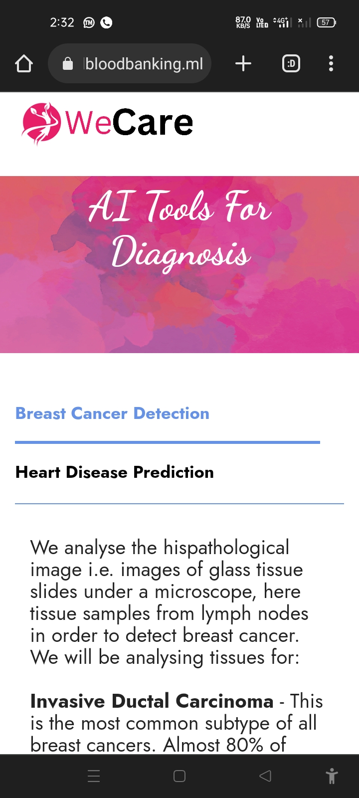
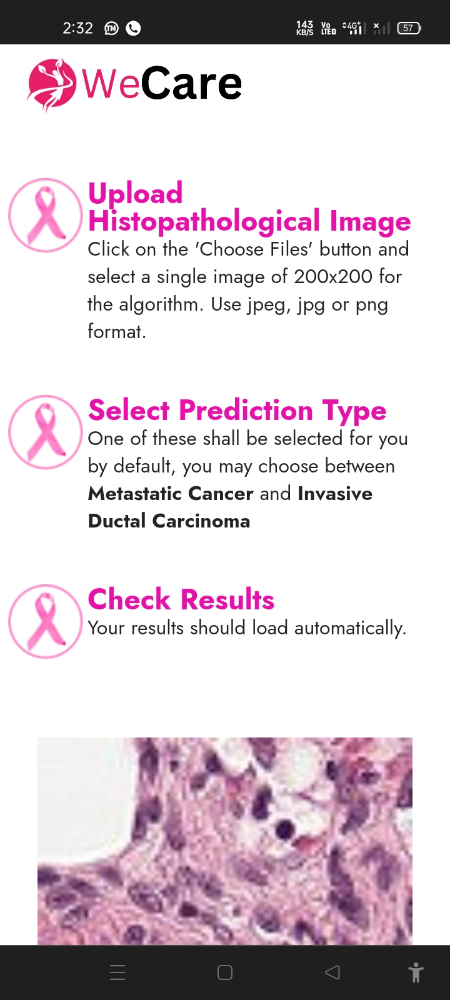
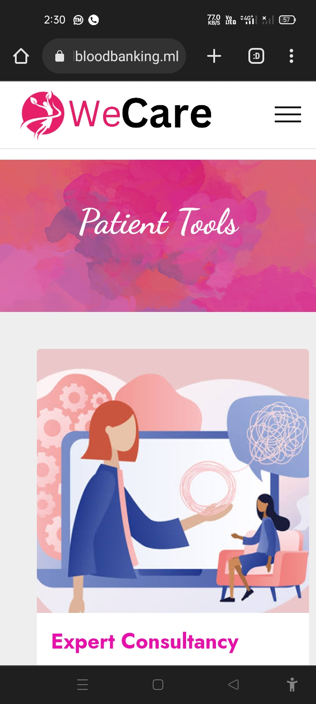
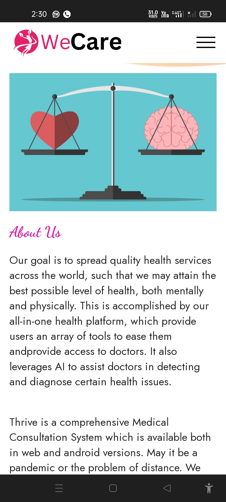
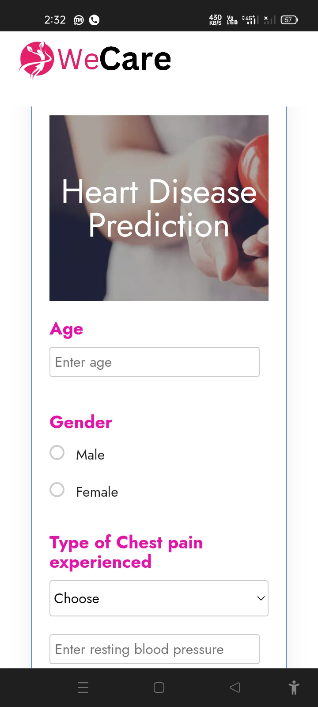
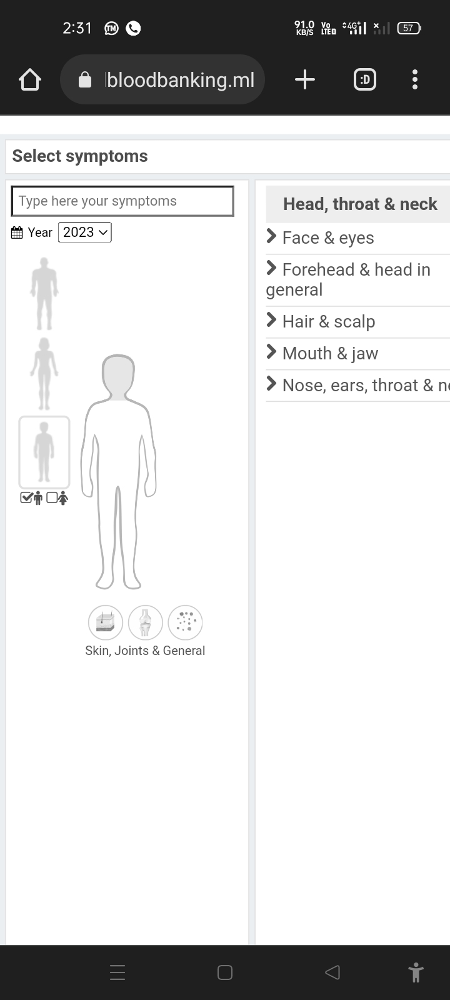
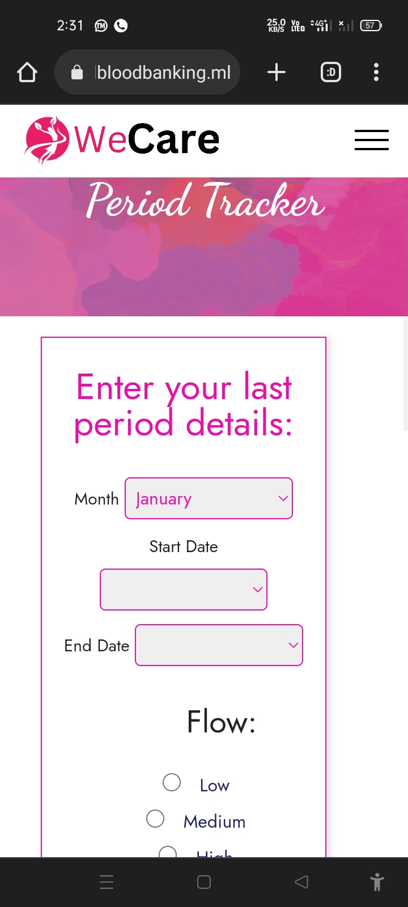

# WECARE - Next-Gen Diagnosis in Healthcare

## Overview
WECARE is an innovative healthcare diagnosis system that leverages cutting-edge technologies to provide advanced medical diagnosis and healthcare solutions. This project aims to revolutionize the healthcare industry by implementing artificial intelligence and machine learning techniques for improved patient care and diagnosis accuracy.

## Problem Statement
Rural and Remote residents encounter barriers to healthcare that restrain their ability to get the medical services they need. The problem of handling and keeping a note and regular monitoring is serious in India. Also, it has been continuously observed in no. of surveys that the nurses and doctors in India suffer through burnout due to heavy workload and hectic schedule, which is a matter of concern. The records of patients are not well-maintained on either grounds and hence seems to be a greater problem in the picture.

## Why This Issue? 🔒
India has a vital shortage of trained doctors universally when compared to the WHO recommended ratio. Additionally, with about 80 per cent of the medicinal workforce focused in the top 8-10 towns and treating only 28 per cent of the total residents, access to healthcare remains a hope for many. In rural India, a patient may have to travel to another city to meet a doctor.

## Objectives 📚
- Develop an AI-powered diagnostic system for accurate disease prediction
- Create a user-friendly interface for both healthcare providers and patients
- Implement real-time monitoring and analysis of patient health data
- Provide personalized treatment recommendations based on patient history
- Enable secure and efficient telemedicine consultations
- Reduce healthcare costs and improve accessibility to quality healthcare

## Solution 🔑

### Product Features
1. **AI-Powered Diagnosis**
   - Real-time disease prediction
   - Symptom analysis and correlation
   - Risk assessment and early warning system
   - Personalized treatment recommendations

2. **Patient Management**
   - Digital patient records
   - Medical history tracking
   - Appointment scheduling
   - Prescription management
   - Follow-up care coordination

3. **Healthcare Analytics**
   - Disease pattern analysis
   - Treatment effectiveness tracking
   - Population health insights
   - Resource utilization optimization

4. **Telemedicine Integration**
   - Virtual consultations
   - Remote patient monitoring
   - Secure video conferencing
   - Digital prescription delivery

## Tools and Technology Used


## Team Members

### Core Development Team

#### Sawan Singh (2101921640047)
- **Role**: Project Lead & Backend Developer
- **Responsibilities**:
  - Project coordination and management
  - Backend architecture design
  - Database management
  - API development
  - System integration

#### Himanshu Tiwari (2101921640018)
- **Role**: Frontend Developer & UI/UX Designer
- **Responsibilities**:
  - User interface design
  - Frontend development
  - User experience optimization
  - Responsive design implementation
  - Cross-browser compatibility

#### Gautam Kumar (2201921649003)
- **Role**: AI/ML Engineer
- **Responsibilities**:
  - Machine learning model development
  - Data analysis and processing
  - AI algorithm implementation
  - Model training and optimization
  - Predictive analytics

#### Krishna Sharma (2101921640020)
- **Role**: Full Stack Developer & Security Expert
- **Responsibilities**:
  - Full stack development
  - Security implementation
  - System testing
  - Performance optimization
  - Documentation

### Project Supervisor
**Dr. Pinki Sagar**  
Assistant Professor  
G.L. Bajaj Institute of Technology & Management, Greater Noida

## Installation and Setup
1. **Prerequisites**
   - PHP 8.0 or higher
   - MySQL 5.7 or higher
   - Apache/Nginx web server
   - Composer (PHP package manager)
   - XAMPP/WAMP/MAMP (for local development)

2. **Server Setup**
   - Install XAMPP/WAMP/MAMP on your system
   - Start Apache and MySQL services
   - Ensure PHP is properly configured in your system

3. **Project Installation**
   ```bash
   # Clone the repository
   git clone https://github.com/your-username/wecare.git
   cd wecare

   # Install dependencies using Composer
   composer install

   # Create database
   # Access phpMyAdmin (http://localhost/phpmyadmin)
   # Create a new database named 'wecare_db'
   ```

4. **Configuration**
   - Copy the configuration file:
     ```bash
     cp config/config.example.php config/config.php
     ```
   - Update the database credentials in `config/config.php`

## Business Model 💰
WeCare would be available both as a product and service for the customers. The customer will subscribe to our services. We would market our system to the general public and aware the doctors and medical fraternity of the benefits of our product. Our product is helpful for all kinds of patients who aren't comfortable/able to visit the doctors/physicians physically. It is equally beneficial and convenient for the doctors as well.

### ScreenShots of WeCare
<pre>
      
</pre>

Built with ❤️ by Team WECARE

