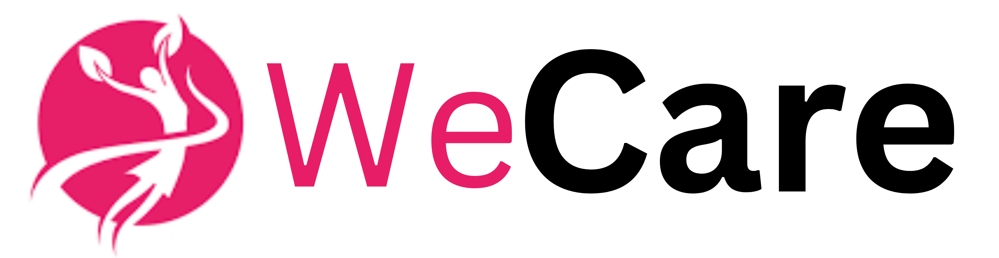

# WeCare
A web and mobile application aimed at providing tools for the complete physical and mental health and well-being of users.

## Overview

WeCare is a comprehensive Medical Consultation System which is available both in web and android versions.

The website offers people better access to healthcare support beyond their bounds of convenience and connects them to doctors, specialists and healthcare experts on a digital platform, which provides them access to an online expert without a physical visit. For doctors, it includes a feature to view-track the medical record of the patient regularly and efficiently.

It also has a series of AI tools that assist the doctors in determining the probabilities of diseases like Breast Cancer etc. It also has a dedicated dashboard which keeps track of medical history of the patients.

## Problem Statement :
Rural and Remote residents encounter barriers to healthcare that restrain their ability to get the medical services they need. The problem of handling and keeping a note and regular monitoring is serious in India. Also, it has been continuously observed in no. of surveys that the nurses and doctors in India suffer through burnout due to heavy workload and hectic schedule, which is a matter of concern. The records of patients are not well-maintained on either grounds and hence seems to be a greater problem in the picture.
and regular checkup is difficult. 

May it be a pandemic or the problem of distance, consulting a good doctor even for a regular checkup and urgent situations that need to be dealt with as soon as possible is a big issue. There's a need for proper management of a patient's historical record and, tracking of current health-stats is one of the challenges in front of the Medical System in India.

Hence, a solution needs to be proposed that solves the problems efficiently and is even accessible to all.

## Why this issue? :lock:
India has a vital shortage of trained doctors universally when compared to the WHO recommended ratio. Additionally, with about 80 per cent of the medicinal workforce focused in the top 8-10 towns and treating only 28 per cent of the total residents, access to healthcare remains a hope for many. In rural India, a patient may have to travel to another city to meet a doctor. The necessity of time is to provide good quality healthcare and a home-monitored healthcare system, to minimize the workload on the medical workforce monitor and patients with low or mild problems remotely.
# MEDICARE - Drug Recommender System

**Objective:**

-The objective of this project is to develop a drug recommendation system for medical practitioners to get information on the popular drugs in the market at any point of time.

**Functionality and Usage:**

-The main functionality of this tool is to recommend drugs available in the market to doctors based on a recommended rating score provided by patient’s reviews and medical conditions. 
-We intend to create this tool to help doctors get an idea about different drugs, with respect to the condition, based on reviews and ratings given by the patients. This would help them to shortlist the best drugs for each ailment and prescribe them accordingly.  
-This tool potentially eliminates the role of an intermediate medical representative from different pharmaceutical companies for briefing and awareness about the available drugs in the market.

## Objectives :  	:notebook_with_decorative_cover:
- To connect patients in remote and rural areas with the best doctors of their choice.
- To provide essential medical services at the lowest possible cost.
- To provide a proper patient medical history management system.
- To provide proper patient monitoring equipment in remote areas, where medical reach is hard or disconnected due to lack of connectivity.
- To assist the medical workforce by using custom made AI tools.
- To ensure physical as well as mental well-being of patients.

# Solution  	:key:

## Product 
1. Website and Android App - For health monitoring and medical consultation

## Features :  	:notebook_with_decorative_cover:
- Dedicated dashboards for both patient and doctor
- Chat and Video Conferencing based Consulation with verified experts around the nation
- Prepares Patient Medical History
- Provides physical and mental health assessment with actionable items
- Period Tracker (for women)
- Chatbot
- Allows you to meditate while listening to the sound of rain/beach

## Tools and Technology Used:

## Business Model / StartUp Potential  	:moneybag:

WeCare would be available both as a product and service for the customers. The customer will subscribe to our services. We would market our system to the general public and aware the doctors and medical fraternity of the benefits of our product. Our product is helful for all kinds of patients who aren't comfortable/able to visit the doctors/physicians physically. It is equally beneficial and convinient for the doctors as well.

### ScreenShots of WeCare
<pre>
      

</pre>
### Contributors
- Sawan
- Arunima
- Divyum

Built with ❤️ by Team ENIGMA

